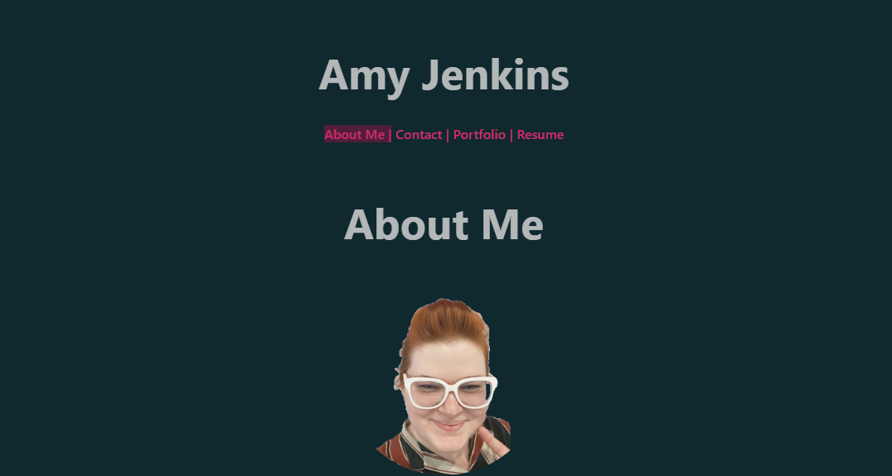

   # React Portfolio
   

   ## Description
   
   This is my portfolio created with react.   
   
   ## Usage
   
   There are 4 navigation links. When the page first opens you see the "About Me" section. Clicking on "contact" you can see form feilds that currently don't submit, but may in the future. Clicking on "Portfolio" you can see some of my projects that I have created. Clicking on "Resume" you can see a list of coding I am proficient in. There is also a downloadable resume. 

   https://amy-jenkins.netlify.app/

   
   
   ## License
   
   MIT

   ## Questions

   For any additional questions, please contact me:
   github.com/GwiyomiAmy
   
   